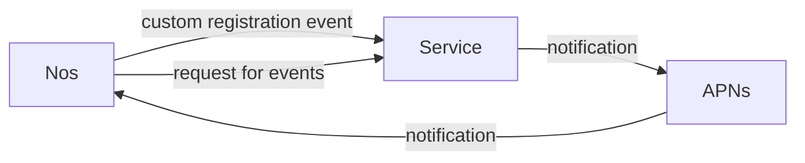
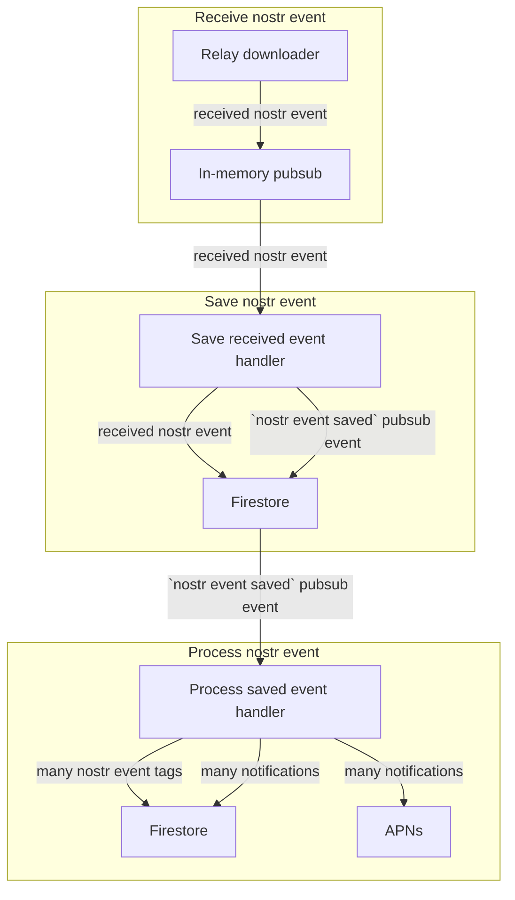

# Nos Notification Service

## Building and running

Buid the program like so:

    $ go build -o notification-service ./cmd/notification-service
    $ ./notification-service

The program takes no arguments. There is a Dockerfile available.

## Configuration

Configuration is performed using environment variables. This is also the case
for the Dockerfile.

### `NOTIFICATIONS_NOSTR_LISTEN_ADDRESS`

Listen address for the websocket connections in the format accepted by the
standard library.

Optional, defaults to `:8008` if empty.

### `NOTIFICATIONS_METRICS_LISTEN_ADDRESS`

Listen address for the prometheus metrics server in the format accepted by the
standard library. The metrics are exposed under path `/metrics`.

Optional, defaults to `:8009` if empty.

### `NOTIFICATIONS_FIRESTORE_PROJECT_ID`

Your Firestore project id.

Required.

### `NOTIFICATIONS_FIRESTORE_CREDENTIALS_JSON_PATH`

Path to your Firestore credentials JSON file.

Required if you are not using the emulator (`FIRESTORE_EMULATOR_HOST` is not set).

### `NOTIFICATIONS_APNS_TOPIC`

Topic on which APNs notifications will be sent. Probably your iOS app id.

Required.

### `NOTIFICATIONS_APNS_CERTIFICATE_PATH`

Path to your APNs certificate file in the PKCS#12 format. They normally come in
a different format I think so you need to presumably export this from your
keychain.

Required.

### `NOTIFICATIONS_APNS_CERTIFICATE_PASSWORD`

Password to your APNs certificate file.

Optional, leave empty if the certificate doesn't have a password.

### `NOTIFICATIONS_ENVIRONMENT`

Execution environment. Affects:
- whether testing or production APNs server is used

Optional, can be set to `PRODUCTION` or `DEVELOPMENT`. Defaults to `PRODUCTION`.

### `NOTIFICATIONS_LOG_LEVEL`

Log level.

Optional, can be set to `TRACE`, `DEBUG`, `ERROR` or `DISABLED`. Defaults to `DEBUG`.

### `FIRESTORE_EMULATOR_HOST`

Optional, this is used by the Firestore libraries and can be useful for testing
but you shouldn't ever have to set this in production.

## Metrics

See configuration for the address of our metrics endpoint. Many out-of-the-box
Go-related metrics are available. We also have custom metrics:

- `application_handler_calls_total`
- `application_handler_calls_duration`
- `relay_downloader_count`
- `subscription_queue_length`

See `service/adapters/prometheus`.

## Contributing

### Go version

The project usually uses the latest Go version as declared by the `go.mod` file.
You may not be able to build it using older compilers.

### How to do local development

#### Obtaining an APNs certificate

1. Obtain a certificate from Apple (see ["Obtain a provider certificate from Apple"][get-apns-cert]). For development **ensure that you are creating a certificate of type "Apple Push Notification Service SSL (Sanbox)"** to avoid sending notifications in production.
2. Export the certificate from your keychain in the PKCS#12 format.

#### Run the service

You have two options when it comes to using Firestore: a local emulator using
Docker or a real Firestore project that we setup for development.

##### Using Firestore emulator

1. Start the docker daemon.
2. Run `make recreate-emulator` to start the Firestore emulator using Docker compose.
3. Run the following command changing `NOTIFICATIONS_APNS_CERTIFICATE_PATH` and `NOTIFICATIONS_APNS_CERTIFICATE_PASSWORD`:

```
NOTIFICATIONS_APNS_CERTIFICATE_PATH="/path/to/your/apns/cert.p12" \
NOTIFICATIONS_APNS_CERTIFICATE_PASSWORD="your cert password if you set one" \
FIRESTORE_EMULATOR_HOST=localhost:8200 \
NOTIFICATIONS_FIRESTORE_PROJECT_ID=test-project-id \
NOTIFICATIONS_APNS_TOPIC=com.verse.Nos \
NOTIFICATIONS_ENVIRONMENT=DEVELOPMENT \
go run ./cmd/notification-service
```

##### Using `nos-notification-service-dev` project

1. [Download credentials for the project][get-firebase-credentials]. **Those are your private credentials don't use them for production**.
2. Run the following command changing `NOTIFICATIONS_APNS_CERTIFICATE_PATH`, `NOTIFICATIONS_APNS_CERTIFICATE_PASSWORD` and `NOTIFICATIONS_FIRESTORE_CREDENTIALS_JSON_PATH`:

```
NOTIFICATIONS_APNS_CERTIFICATE_PATH="/path/to/your/apns/cert.p12" \
NOTIFICATIONS_APNS_CERTIFICATE_PASSWORD="your cert password if you set one" \
NOTIFICATIONS_FIRESTORE_CREDENTIALS_JSON_PATH="/path/to/your/credentials/file.json" \
NOTIFICATIONS_FIRESTORE_PROJECT_ID="nos-notification-service-dev" \
NOTIFICATIONS_APNS_TOPIC=com.verse.Nos \
NOTIFICATIONS_ENVIRONMENT=DEVELOPMENT \
go run ./cmd/notification-service
```

### Tips and tricks

Normally the program doesn't deliver the same notification multiple times. You
could fix it by clearing the emulator but it is probably easier to comment out
lines that look similar to this in
`service/app/handler_process_received_event.go`:

```
exists, err := adapters.Events.Exists(ctx, cmd.event.Id())
if err != nil {
   return errors.Wrap(err, "error checking if event exists")
}

if exists {
   return nil
}
```

### Makefile

We recommend reading the `Makefile` to discover some targets which you can
execute. It can be used as a shortcut to run various useful commands.

You may have to run the following command to install a linter and a code
formatter before executing certain targets:

    $ make tools

If you want to check if the pipeline will pass for your commit it should be
enough to run the following command:

    $ make ci

It is also useful to often run just the tests during development:

    $ make test

Easily format your code with the following command:

    $ make fmt

### Writing code

Resources which are in my opinion informative and good to read:

- [Effective Go][effective-go]
- [Go Code Review Comments][code-review-comments]
- [Uber Go Style Guide][uber-style-guide]

#### Naming tests

When naming tests which tests a specific behaviour it is recommended to follow a
pattern `TestNameOfType_ExpectedBehaviour`. Example:
`TestRelayDownloader_EventsDownloadedFromRelaysArePublishedUsingPublisher`
.

#### Panicking constructors

Some constructors are prefixed with the word `Must`. Those constructors panic
and should always be accompanied by a normal constructor which isn't prefixed
with the `Must` and returns an error. The panicking constructors should only be
used in the following cases:
- when writing tests
- when a static value has to be created e.g. `MustNewHops(1)` and this branch of
  logic in the code is covered by tests

### Architecture

The notification service receives custom Nostr events which contain user's relays and APNs tokens. The notification service then uses those lists of relays associated with user's public key to get all events in which the user was tagged and to generate APNs notifications for them. When Nos receives such a notification it grabs the events from the notification service by querying it like a normal relay.



The best entry point to start reading the code is probably `service/ports/http`. There you can investigate how registration events are processed and saved in the database. You can also investigate how events are returned in response to `REQ` requests.

To see how events are downloaded check out `Downloader` as well as `RelayDownloader`. One tricky thing there is that we use pubsub to work around the (reasonable as it forces you to do things correctly) Firestore transaction size limit. See the chart below to understand the flow.



[get-apns-cert]: https://developer.apple.com/documentation/usernotifications/setting_up_a_remote_notification_server/establishing_a_certificate-based_connection_to_apns#2947597
[get-firebase-credentials]: https://firebase.google.com/docs/admin/setup#initialize_the_sdk_in_non-google_environments

[effective-go]: http://golang.org/doc/effective_go.html
[code-review-comments]: https://github.com/golang/go/wiki/CodeReviewComments
[uber-style-guide]: https://github.com/uber-go/guide/blob/master/style.md
